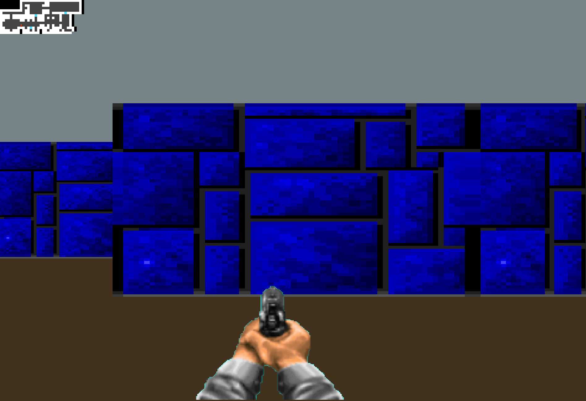
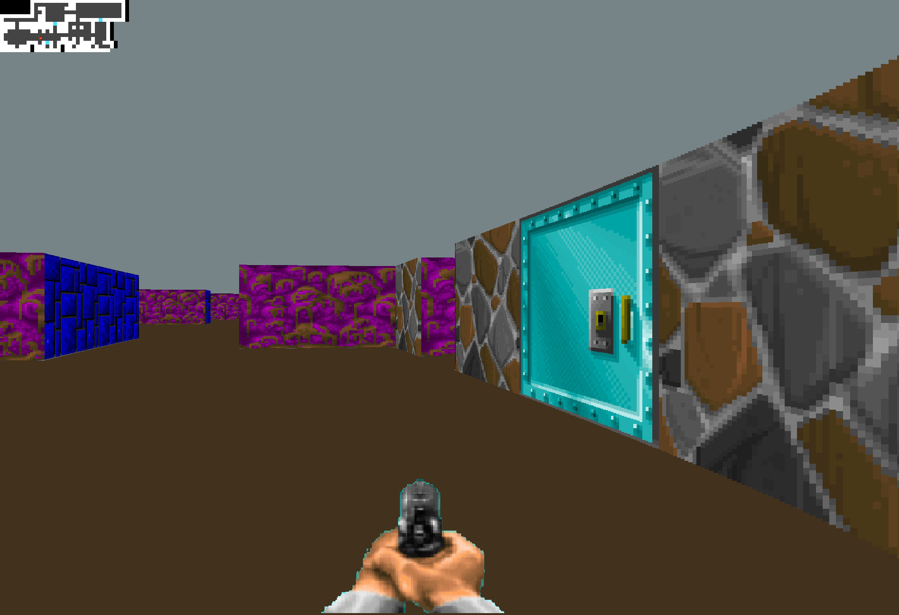

# Cub3D - 3D Raycasting Game Engine

A simplified 3D game engine inspired by Wolfenstein 3D, built from scratch in C using raycasting techniques and minilibx for graphics rendering. 


## ✨ Game Features

- **Raycasting Engine** - Real-time 3D rendering using 2D raycasting algorithms
- **Textured Walls** - Different textures for North, South, East, and West walls
- **Mouse Look** - Smooth camera rotation with mouse movement
- **WASD Controls** - Player's movements with keybaord event management 
- **Collision Detection** - Realistic wall collision system
- **Map Parser** - Custom map format with configurable layouts
- **Minimap with live movement** - Display of a minimap showing player's movements

## 🛠️ Tech Stack

**Core Technologies:**

- **C** - Low-level programming for performance
- **MinilibX** - Minimalist graphics library for pixel manipulation
- **Raycasting Algorithm** - Mathematical 3D projection technique
- **Makefile** - Build automation

**Graphics Techniques:**

- Grid Traversal Raycasting / DDA grid traversal
- Texture mapping and scaling with fisheye correction
- Frame buffer management

## 🚀 Quick Start

### Prerequisites

- GCC compiler
- Make
- MinilibX library
- X11 development libraries (Linux)
- Xcode Command Line Tools (macOS)

### Installation

1. **Clone the repository**
    
    ```bash
    git clone https://github.com/CymF96/Cub3D.git cub3D
    cd cub3D
    
    ```
    
2. **Build the project**
    
    ```bash
    make
    
    ```
    
4. **Run the game**
    
    ```bash
    ./cub3D maps/basic.cub
    
    ```
    

## 🎮 Controls

| Key | Action |
| --- | --- |
| `W` | Move forward |
| `S` | Move backward |
| `A` | Strafe left |
| `D` | Strafe right |
| `E` | Open door |
| `←` `→` | Rotate camera left/right |
| `Mouse` | Look around (mouse movement) |
| `ESC` | Exit game |


## 🗺️ Map Format

Maps are defined in `.cub` files with the following format:

```
NO ./textures/north_wall.xpm
SO ./textures/south_wall.xpm
WE ./textures/west_wall.xpm
EA ./textures/east_wall.xpm
DO ./textures/doors.xpm

C 220,100,0 
F 255,30,0

1111111111
1010000001
1010N00101
10D0000001
1111111111

```

- `NO/SO/WE/EA/DO`: Texture paths for each wall direction and doors. File must be in .xpm format extension
- `C`: Ceiling color (RGB)
- `F`: Floor color (RGB)
- `1`: Wall, `0`: Empty space `E`: Doors
- `N/S/E/W`: Player start position and orientation

## 🧮 Raycasting Algorithm

The engine implements a classic raycasting approach:

1. **Ray Generation** - Cast rays from player position at each screen column
2. **Bresenham Approach** - Step through grid cells until hitting a wall with integer arithmetic
3. **Distance Calculation** - Compute perpendicular distance to avoid fisheye effect
4. **Wall Height** - Calculate wall slice height based on distance
5. **Texture Mapping** - Apply appropriate wall texture with scaling

## 📱 Screenshots






## 🚀 Building and Compilation

```bash
# Standard build
make

# Clean object files
make clean

# Complete clean (including executable)
make fclean

# Rebuild everything
make re

# Debug build with symbols
make debug

```

## 📚 Learning Resources

- [Raycasting Tutorial](https://lodev.org/cgtutor/raycasting.html)
- [Wolfenstein 3D's map renderer](https://github.com/id-Software/wolf3d)

## 📝 License

This project is part of the 42 School curriculum and follows their academic guidelines.

## 👨‍💻 Authors

**Coline Fischer** and **Vinicius Bass**

- GitHub: [@CymF96](https://github.com/CymF96)
- Github: [@Vinny-Bass] (https://github.com/Vinny-Bass)

## 🏆 42 School Project

This project is part of the 42 School common core curriculum, focusing on:

- **Computer Graphics** - Understanding 3D rendering principles
- **Algorithm Implementation** - Raycasting and DDA algorithms
- **C Programming** - Low-level memory management and optimization
- **Mathematical Application** - Practical use of trigonometry and vectors

**Grade:** 120/100

---
